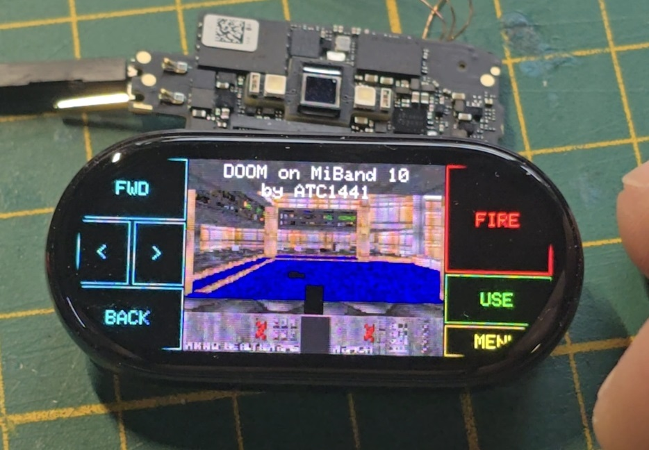
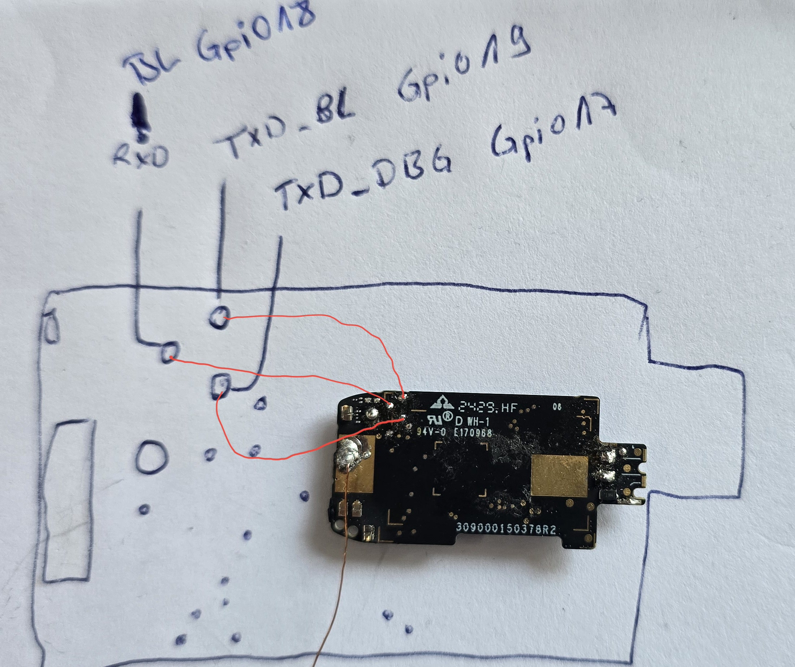

# MiBand 10 SDK - BES2700iMP / BEST1503 (with DOOM)

A working, buildable firmware SDK for the **Xiaomi Mi Band 10** application SoC,
with a full custom display + touch bring-up and a port of **DOOM** running on the
device.

This repository documents *what* the chip is, *where* the SDK came from, and
*how* the missing pieces were recovered so that custom firmware can be built,
flashed and actually run on the watch.
---

This repo is made together with these explanation videos:(click on it)

[](https://www.youtube.com/watch?v=oFswl8FKiRo)

[](https://www.youtube.com/watch?v=XdoPEcibQdg)



---

## TL;DR

* The Mi Band 10 main SoC is the **BES2700iMP**, known internally at BES as
  **BEST1503**.
* No SDK was ever published for the BEST1503. The closest public code is a leaked
  SDK for the audio-oriented **BES2700IHC / BEST1306**.
* Starting from that BEST1306 SDK, the BEST1503-specific differences (memory map,
  clocks, the display controller and the touch controller) were recovered by
  **reverse-engineering the stock Mi Band firmware**, and added here.
* Flashing the watch - and the device pinout - was the single hardest part. It
  was solved using a separate leak of a BES flashing tool that happened to ship
  the SecondStage bootloader blobs for every BEST variant.
* On top of the working firmware, **GBADoom** was ported. It boots, runs at
  **~36 FPS in full 16-bit colour (RGB565)** over a **hardware Quad-SPI** display
  path, and is controlled through the touchscreen.

The SDK folder is named **`MiBand10_SDK_BES2700IMP_BEST1503_DOOM`**.

> **Mi Band 9 / Mi Band 10:** both bands use the same **BES2700iMP / BEST1503**
> SoC and are in general very similar, so this work is expected to apply to both.
> Everything here, however, was only developed and tested on the **Mi Band 10**.

---

## 1. The chip and the naming maze

BES (Bestechnic) sells the same silicon under several names, which makes finding
documentation and source confusing:

| Marketing name | BES internal name | Where it is used | Focus |
| --- | --- | --- | --- |
| **BES2700iMP** | **BEST1503** | **Mi Band 10 application processor** | Wearable / display |
| BES2700IHC | BEST1306 | TWS earbuds and audio devices | Audio |

The BEST1503 and BEST1306 are close relatives - same ARM Cortex-M33 core family,
similar peripherals and a near-identical ROM layout - but they are **not** drop-in
compatible. The two diverge exactly where it matters for a watch:

* **Memory map** - the BEST1503 has more on-chip SRAM and a different bank layout.
* **Clocks / PMU** - different display and PSRAM clock trees.
* **Display controller** - the BEST1503 drives an AMOLED panel (the BEST1306 has
  no display path wired up).
* **Touch controller** - the watch uses a capacitive touch IC the audio SDK knows
  nothing about.

Because the BEST1503 is a wearable part, BES never released a public SDK for it.

---

## 2. Where the SDK came from

There is no BEST1503 SDK in the wild. Two leaks made this project possible:

1. **The BEST1306 / BES2700IHC SDK source leak**
   <https://github.com/sprlightning/audio_prj_collections>
   This is an audio-product SDK (TWS earbuds). It contains the full BES build
   system, the RTOS, the BT host, the HAL and the boot flow - everything except
   the parts that are specific to a watch. It is the foundation this repository
   is built on.

2. **A BES flashing tool, leaked inside another project**
   <https://github.com/Derek-Vencer/tws_earbuds>
   This repository shipped the host-side flashing flow **and**, crucially, the
   SecondStage bootloader `.bin` blobs for *every* BEST variant. That is what
   ultimately allowed writing code to the Mi Band 10.

Everything BEST1503-specific in this tree (the `best1503` HAL variant, the display
glue, the touch glue, the corrected memory map) was produced by reverse-
engineering the stock Mi Band firmware and cross-checking it against the BEST1306
code, then filling in the gaps.

---

## 3. What the SDK does

This is a complete embedded firmware SDK based on the BES kbuild system:

* **Core** - ARM Cortex-M33 startup, the RTX5 RTOS, the BES memory pools and
  heap, the fault handlers and the boot/trace plumbing.
* **HAL** - clocks (CMU), timers, GPIO/IOMUX, flash controller, UART, I2C/SPI,
  PMU and the chip-specific `best1503` HAL layer.
* **Boot flow** - `platform/main/main.cpp` brings the chip up, then (in this
  build) hands control to the on-device hardware self-test, which is where the
  display, touch and DOOM bring-up live.
* **Linker scripts** - `scripts/link/best1000_1306.lds.S`, driven by the
  per-chip address map in `platform/hal/best1503/plat_addr_map_best1503.h`.
* **Target configuration** - `config/best1503/` selects features, board pins and
  build options.

The BES2700IHC SDK is an *audio* SDK; for this watch build the entire audio
subsystem is left out (the Mi Band has no audio hardware), which both simplifies
the firmware and frees a large amount of flash for the DOOM WAD (see
[§7 Memory & size](#7-memory--size)).

---

## 4. What was recovered by reverse-engineering the stock firmware

The stock Mi Band runs a Vela/NuttX-based image. By analysing it, the following
BEST1503-only pieces were reconstructed and wired into the SDK:

### Memory map
The BEST1306 headers describe only 512 KB of SRAM (4 × 128 KB banks). The
BEST1503 actually has **1.4 MB (0x160000)** of contiguous on-chip SRAM - this was
confirmed against a RAM dump of the running chip and is now reflected in
`plat_addr_map_best1503.h` (`RAM3_SIZE` / `RAM_TOTAL_SIZE`). The flash is **4 MB**
(the SDK default of 2 MB was corrected in `config/best1503/target.mk`).

### Display - RM690B0/C0 AMOLED
The panel is a Raydium **RM690B0/C0** AMOLED (≈212 × 520 visible). It is driven
through the BES **LCDC SMPN** path as a **4-lane hardware Quad-SPI** command
stream (`platform/main/disp_hwquad.c`, raw MMIO, no SDK calls):

* **Clock tree** - the display power island and clock multipliers are brought up
  exactly as the stock firmware does. The stripped best1503 boot omits the
  clock-tree module enables the LCDC's DMA master needs, so they are restored by
  hand; the display clock is the **96 MHz OSC×4 tap**.
* **Init** - the panel **RDID is read back** (`0xDA/0xDB/0xDC`) and used to
  auto-select the matching variant (init table + CASET X-offset), falling back
  to a default panel; a full init sequence (manufacturer page, COLMOD, MADCTL,
  CASET/RASET, sleep-out, display-on, brightness) is then replayed over the
  single-line command engine.
* **Pixels** - frames are streamed by the LCDC **GEN_FRAME generator** as
  **16 bpp RGB565** (two bytes per pixel) over all four data lanes, with the
  hardware auto-head emitting the `0x32` / `0x2C` quad-write opcode. The write
  window is set on the command engine first because the generator only emits the
  `0x2C` RAMWR itself.
* **Framing** - CS is driven manually around each transfer and held low until
  the **TXC** (transmit-complete) gate so the panel commits the RAMWR; the
  serializer is flushed and the SMPN re-armed every frame.
* **Ping-pong double buffer** - the transfer runs in hardware (GRA-DMA +
  serializer), so `disp_hwquad_start()` kicks a frame and returns; the CPU
  renders the *other* buffer while one is in flight, and `disp_hwquad_wait()`
  blocks on TXC before the swap.

The whole display path was traced register-by-register out of the stock
firmware (`vela_ota.bin` / `vela_ap.bin`, the **best1503** image - not the
best1306 SDK) and re-implemented from scratch. The bring-up started on a 1-lane
RGB332 FIFO path and was later upgraded to the full Quad-SPI RGB565 mode.

### Touch - Hynitron CST92xx
The capacitive touch controller is a **Hynitron CST92xx** at I²C address `0x5A`,
bit-banged on GPIO pins 6/7 with an interrupt line on pin 27. The touch report
format (event byte, 12-bit packed X/Y, frame marker, ACK-to-refresh) was
reverse-engineered and is read directly by the firmware.

> The original BES `hal_gpio` rejects pins ≥ 38; the BEST1503 has many more GPIOs,
> so register-level GPIO/IOMUX helpers are used instead.

---

## 5. DOOM

A port of **GBADoom** (the doomhack GBA port lineage) lives in
[`apps/doom/`](apps/doom/). It is gated behind the `DOOM=1` build switch so the
normal firmware build is unaffected.

What was done to make it run on the BEST1503:

* **Self-contained engine** - the engine sources were made independent of their
  original board SDK; a small glue layer (`bes_glue.c`, `bes_compat.h`, `lcd.c`)
  bridges DOOM to the BES HAL.
* **Display** - DOOM renders an 8 bpp palettised frame; `lcd.c` converts the
  active palette to the panel's **RGB565** (full 16-bit colour) and writes it
  over the Quad-SPI path, running at **~36 FPS**. The watch is held in
  **landscape**, so the 120 × 160 DOOM image is rotated 90° and scaled to
  282 × 212 to fill the panel height, centred along the long axis with a control
  strip painted once at each end (arrow keys / function keys).
* **Input** - the touchscreen is mapped to DOOM: tap zones around the game image
  for movement/turn, the centre for fire, and on-screen buttons for use/menu.
* **Timing** - DOOM's 35 Hz tick is derived from the BES system timer; a
  once-per-second frame counter prints `DOOM FPS: N` straight to the trace UART
  (polled, since once DOOM owns the CPU the SDK's buffered trace never flushes).
* **Memory** - the two 212 × 520 RGB565 ping-pong buffers (220 KB each) sit at
  the bottom of SRAM, and DOOM gets its own dedicated **248 KB arena above
  them**; the linker keeps the system stack/pool below the framebuffers when
  `DOOM=1`. The 256 KB GBA reciprocal lookup table was dropped in favour of the
  Cortex-M33 hardware divider, saving flash.
* The IWAD is embedded directly in flash and read in place (XIP).

---

## 6. Building

Requirements (Windows): **MSYS2 `make` 4.4.1** and the **arm-none-eabi GCC**
toolchain (10.3.x) on `PATH`. A `GNUmakefile` wrapper drives the SDK build.

```sh
# normal watch firmware (no DOOM)
make clean all  T=best1503 CHIP=best1503 DEBUG=1 MAGIC_NUM=1 LIBC_ROM=0 HW_SELFTEST=1

# firmware with DOOM (audio subsystem dropped to make room)
make clean all  T=best1503 CHIP=best1503 DEBUG=1 MAGIC_NUM=1 LIBC_ROM=0 HW_SELFTEST=1 DOOM=1
```

A bare `make` builds incrementally and flashes; `clean` is only run when you ask
for it (a from-scratch build is slow). The output image is
`out/best1503/best1503.bin`.

Key build switches (`config/best1503/target.mk`):

| Switch | Meaning |
| --- | --- |
| `T` / `CHIP` | always `best1503` for this device |
| `HW_SELFTEST=1` | build the on-device display/touch/DOOM bring-up |
| `DOOM=1` | compile and launch DOOM (drops the audio subsystem) |
| `LIBC_ROM=0` | required - the ROM libc thunks hold BEST1306 ROM addresses |
| `MAGIC_NUM=1` | bake the boot-header magic |

---

## 7. Memory & size

| Region | Size | Notes |
| --- | --- | --- |
| SRAM | **1.4 MB** | corrected from the SDK's 512 KB |
| Flash | **4 MB** | corrected from the SDK's 2 MB |
| Framebuffer | 212 × 520, 16 bpp RGB565 | **2 ×** 220 KB ping-pong buffers (Quad-SPI) |
| DOOM arena | 248 KB | dedicated heap above the framebuffers (`DOOM=1`) |

The DOOM build drops the entire audio stack (codecs, audio processing, media
player, the audio apps and services) because the watch has no audio hardware.
Combined with replacing the reciprocal table, this frees roughly **0.7 MB** of
flash - taking a build that overflowed the 4 MB part back down to ~89 % usage,
leaving room for a full IWAD.

---

## 8. Flashing

Flashing is done over UART using a Python flasher (`flasher/`) and the SecondStage
bootloader blob recovered from the leaked flasher tool. The single hardest part of
this whole project was **finding the flasher protocol and the Mi Band test pads /
pinout** - without the SecondStage `.bin` from
[Derek-Vencer/tws_earbuds](https://github.com/Derek-Vencer/tws_earbuds) there was
no way in.



```sh
make flash PORT=COM9        # flash out/best1503/best1503.bin to a serial port
```

`auto_test.py` automates a power-cycle + flash + serial-log capture (it uses a
Nordic PPK2 for power control); adjust the COM ports and baud at the top of the
script to match your wiring. The debug/trace UART runs at 921600 baud.

> ⚠️ Flashing replaces the stock firmware. Make a full backup of the device flash
> first, and only do this if you understand the recovery path. This is
> unofficial, has no warranty, and can brick your device.

---

## 9. DOOM controls (touch)

The control zones are drawn on screen around the game image:

* **Tap above / below / left / right of the image** - move forward / back, turn
  left / right (hold to keep moving).
* **Tap the centre (the game view)** - fire.
* **Top-left button** - `START` (open / close menu, escape).
* **Top-right button** - `USE` (open doors, confirm menu, start a new game).

To start a game: tap `START`, then `USE` to select *New Game* and the skill.

---

## 10. Repository layout

```
MiBand10_SDK_BES2700IMP_BEST1503_DOOM/
├── platform/        ARM startup, HAL, the best1503 chip layer, main + bring-up
│   └── hal/best1503/plat_addr_map_best1503.h   corrected memory map
├── config/best1503/ target configuration, board pins, feature switches
├── scripts/link/    linker scripts (best1000_1306.lds.S + tail_section)
├── apps/            application modules
│   └── doom/        the GBADoom port + BES glue + embedded IWAD
├── services/        system services (BT host, storage, …)
├── bthost/          Bluetooth host stack
├── rtos/            RTX5 RTOS
├── flasher/         host-side UART flasher + SecondStage bootloader
├── lib/ utils/ thirdparty/  support libraries
├── GNUmakefile      build + flash wrapper
└── Makefile         the SDK build (driven by the wrapper)
```

---

## 11. Videos

| Preview | Video |
| --- | --- |
| [](https://youtu.be/iqyR_LNp9vc) | **[Mi Band 8 DOOM port](https://youtu.be/iqyR_LNp9vc)** - an earlier DOOM port running on the Mi Band 8. |
| [](https://youtu.be/BjN_QfSacsc) | **[Mi Band 9 teardown](https://youtu.be/BjN_QfSacsc)** - teardown of the Mi Band 9, recorded while it was still in the "no hacking" state. |
| [](https://youtu.be/QmVwbeRdpVA) | **[Mi Band 10 teardown](https://youtu.be/QmVwbeRdpVA)** - teardown of the Mi Band 10, also recorded under the previous "no hacking" status, which this project now makes obsolete. |

---

## 12. Sources & credits

* **BEST1306 / BES2700IHC SDK leak** -
  <https://github.com/sprlightning/audio_prj_collections>
* **BES flasher tool + SecondStage bootloader blobs** -
  <https://github.com/Derek-Vencer/tws_earbuds>
* **GBADoom** - the doomhack GBA DOOM port lineage.
* **DOOM** - id Software, released under the GPL.

The BEST1503-specific HAL, the display/touch bring-up, the corrected memory map,
the flashing flow for the Mi Band, and the DOOM port were all developed here by
reverse-engineering the stock firmware and adapting the leaked BEST1306 SDK.

---

## 13. Disclaimer

This is an independent, unofficial project. It is not affiliated with, endorsed by
or supported by Xiaomi or Bestechnic. All trademarks belong to their respective
owners. The leaked SDK and tools referenced above are linked for documentation
only. Flashing custom firmware can permanently damage your device - proceed
entirely at your own risk.
